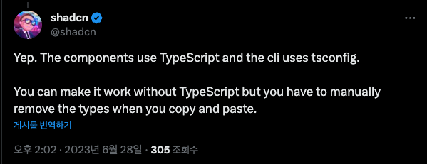
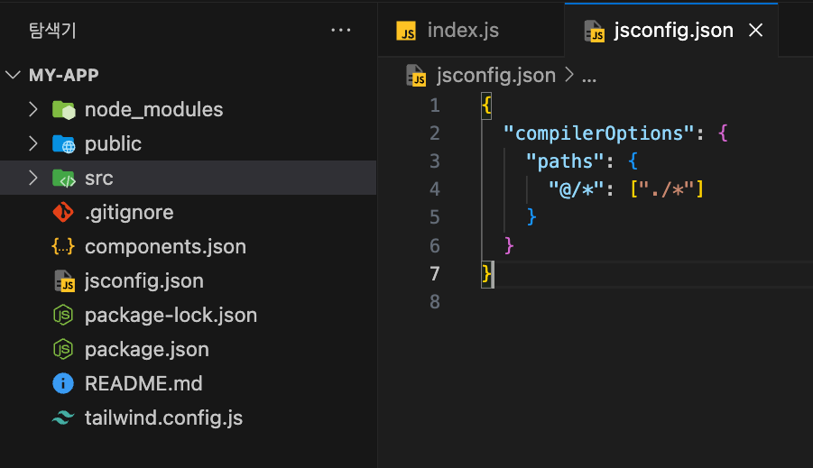
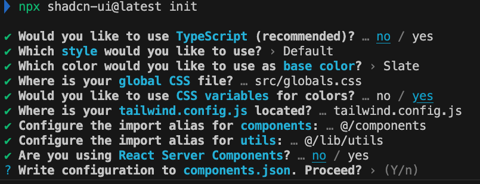
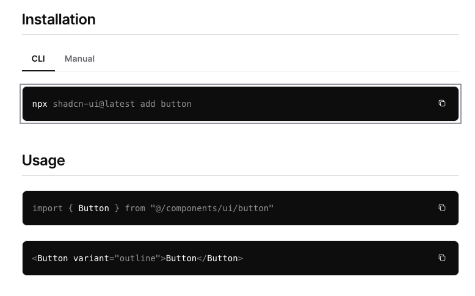
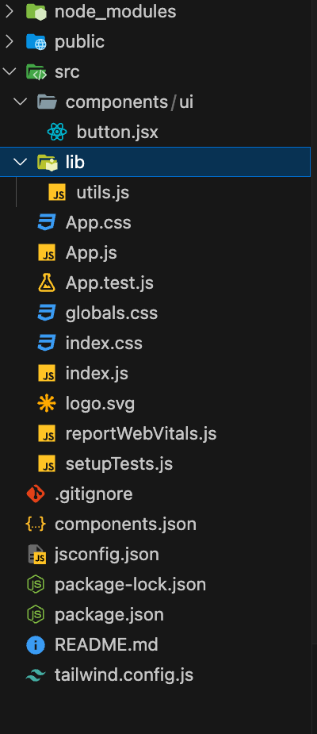
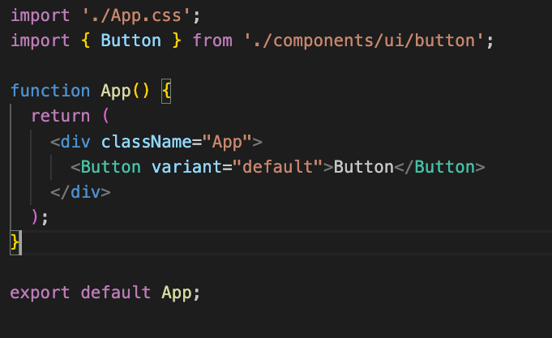

[shadcn](https://ui.shadcn.com/docs/installation/manual)

## shadcn ui가 뭘까?

shadcn ui는 부트스트랩이나 ant Design과 같은 UI 프레임워크가 아닙니다.
부트스트랩과 같은 프레임워크는 보통 npm을 통해 설치하여 종속성을 가집니다.

하지만 shadcn은 **재사용 가능한 컴포넌트**의 모음으로 npx를 통해
필요한 컴포넌트 (ex. Button, Card, Tooltip, Dropdown)를 설치하면
프로젝트 내부의 components/ui 폴더에 재사용 가능한 컴포넌트를 설치하여 사용하는 방식입니다.

```cs
$ npx shadcn-ui@latest add button
```


## 이글을 쓰는 이유

기본적으로 shadcn은 typescript에 최적화 되어 제작되어 있기때문에 타입스크립트를 사용하지 못하는 환경에서

사용하려면 추가적인 처리가 필요합니다. 따라서 타입스크립트에 익숙하지 않은 분들이 shadcn을 사용할 수 있도록

create-react-app부터 shadcn을 설정하여 사용하는 방법을 이글에서 다루도록 하겠습니다.

아래는 shadcn의 개발자분의 말씀으로, 자바스크립트 환경에서 사용하려면 타입을 제거해야 합니다.


또한 타입스크립트 환경과 달리 alias 설정이 안되기 때문에 이를 설정해 줘야합니다.
(정 하고싶으면 eject로 webpack 파일을 꺼내야함)

tsconfig.json 와 jsconfig.json의 차이인데, 타입스크립트는 한번 js로 컴파일되어 실행되기 때문에
별칭들을 올바른 경로로 바꿔 컴파일 됩니다. 하지만 자바스크립트는 코드에디터(vscode)상의 별칭만 인식되고
실제 실행할때 별칭 그대로 실행되기 때문에 실행시 에러가 발생합니다.

```json
// shadcn
{
  "compilerOptions": {
    "baseUrl": "src",
    // 아래의 별칭은 js 환경에선 사용 x
    "paths": {
      "@/*": ["./*"]
    }
  }
}
```

# Installation

## Create React App을 통해 리액트 프로젝트 생성하기

```cs
npx create-react-app my-app
```

## Tailwind Css 설치하기

[공식문서 참고](https://tailwindcss.com/docs/installation)

```cs
npm install -D tailwindcss
```

### Tailwind Init

```cs
npx tailwindcss init
```

tailwind.config.js 수정 (공식문서 보면 나옴)

```cs
/** @type {import('tailwindcss').Config} */
module.exports = {
  content: ["./src/**/*.{html,js}"],
  theme: {
    extend: {},
  },
  plugins: [],
}
```

### src/globals.css 파일 생성

```css
@tailwind base;
@tailwind components;
@tailwind utilities;
```

### index.js에서 globals.css 임포트

```jsx
import React from 'react';
import ReactDOM from 'react-dom/client';
import App from './App';
import reportWebVitals from './reportWebVitals';
import './globals.css';

const root = ReactDOM.createRoot(document.getElementById('root'));
root.render(
  <React.StrictMode>
    <App />
  </React.StrictMode>
);

reportWebVitals();
```

## shadcn 설정

### jsconfig.json 파일 생성



```json
{
  "compilerOptions": {
    "baseUrl": "src" // 절대경로를 src로 바꿔줌
  }
}
```

### shadcn cli 실행

```cs
npx shadcn-ui@latest init
```

아래 설정대로 작성해주고 마지막에 y를 누르면 됩니다.


### 생성된 components.json 수정하기

```ts
{
  "$schema": "https://ui.shadcn.com/schema.json",
  "style": "default",
  "rsc": false,
  "tsx": false,
  "tailwind": {
    "config": "tailwind.config.js",
    "css": "src/globals.css",
    "baseColor": "slate",
    "cssVariables": true
  },
  // 이 부분
  // (이전 단계에서 cli 설정할때 변경해도됨)
  "aliases": {
    "components": "components",
    "utils": "lib/utils"
  }
}

```

## 이제 사용하기

[shadcn 공식문서](https://ui.shadcn.com/docs)

위 공식문서에서 필요한 컴포넌트를 클릭하면 다운받는 링크와 사용법이 적혀있습니다.



```cs
npx shadcn-ui@latest add button
```

실제로 위 커맨드로 button을 설치하면 아래와 같이 button 컴포넌트를 받아오게 됩니다.



### 실제 사용




