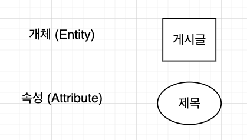
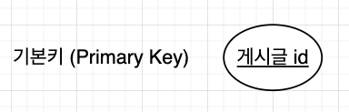
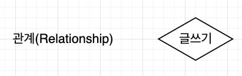
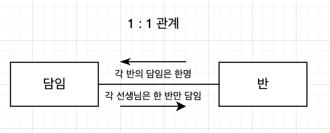
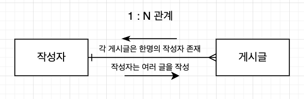
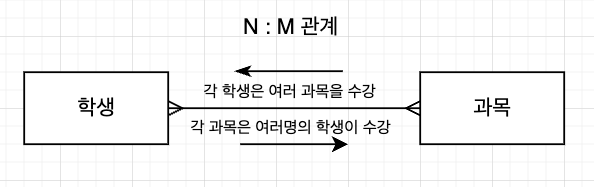
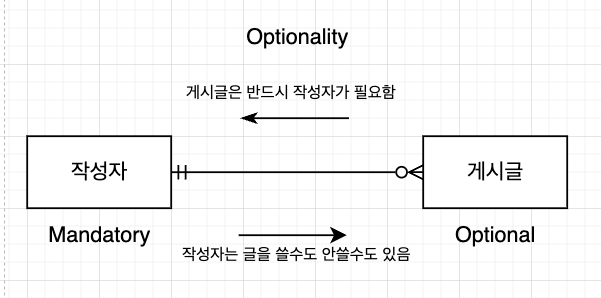
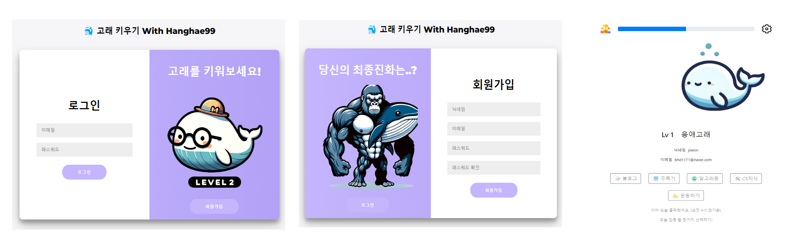

## ERD 구성요소와 표기법

#### 개체(Entity)와 속성(Attribute)

- **개체(Entity)**: DB에 저장될 테이블이며, 주로 현실 세계의 사람, 장소, 사물, 개념등을 추상화시켜 컴퓨터에 저장되는 정보의 단위 입니다. (회원, 게시글, 예약 정보)

- **속성(Attribute)**: DB 테이블의 열(Columns)로 표현되며, 엔티티의 특성이나 성질을 나타내는 데이터 필드입니다. (이메일, 이름, 주소)

#### 식별자

- **기본 키(Primary Key)**: 각 엔티티 인스턴스를 고유하게 식별하는 속성으로, 기본 키는 엔티티 내에서 유일해야 하며, null 값을 가질 수 없습니다.

- **외래 키(Foreign Key)**: 다른 엔티티의 인스턴스를 참조하는 속성입니다. 외래 키는 한 엔티티가 다른 엔티티와 어떻게 관련되어 있는지를 나타내며, 관계를 설정하는 데 사용됩니다.

#### 관계

엔티티 간의 연관성을 설명합니다.

#### 카디널리티(Cardinality)

Entity간의 연관된 인스턴스의 수를 나타내며, 다음과 같은 종류가 있습니다.

##### 1 : 1 관계

##### 1 : N 관계

##### N : M 관계

#### 옵셔널리티(Cardinality)

엔티티 간의 관계가 필수인지 아닌지를 나타내며 다음과 같이 표기합니다.

### 잡설

[고래키우기 Github](https://github.com/woo3145/growup-whale)

항해 99의 사전 스터티 기간에 진행한 3일간의 프로젝트에서 명확한 DB설계와 토론을 하지 않아 많은 난항을 겪었습니다. 고래키우기 프로젝트를 ZEP의 사이드바에 넣어 자신이 키운 고래로 변신할 수 있는 앱을 구상중인데, 다음글에서 위 내용을 바탕으로 ZepApp 프로젝트의 ERD를 설계하는 글을 포스팅 하겠습니다.
