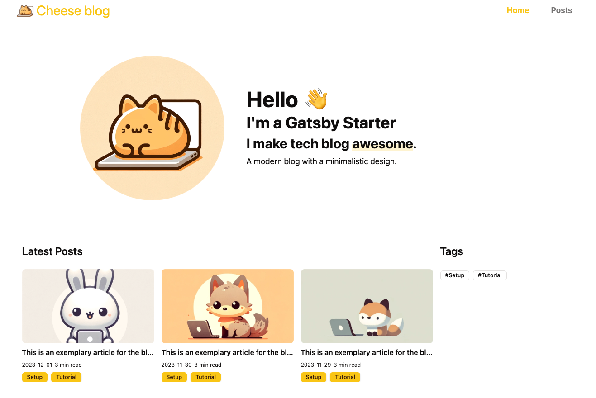
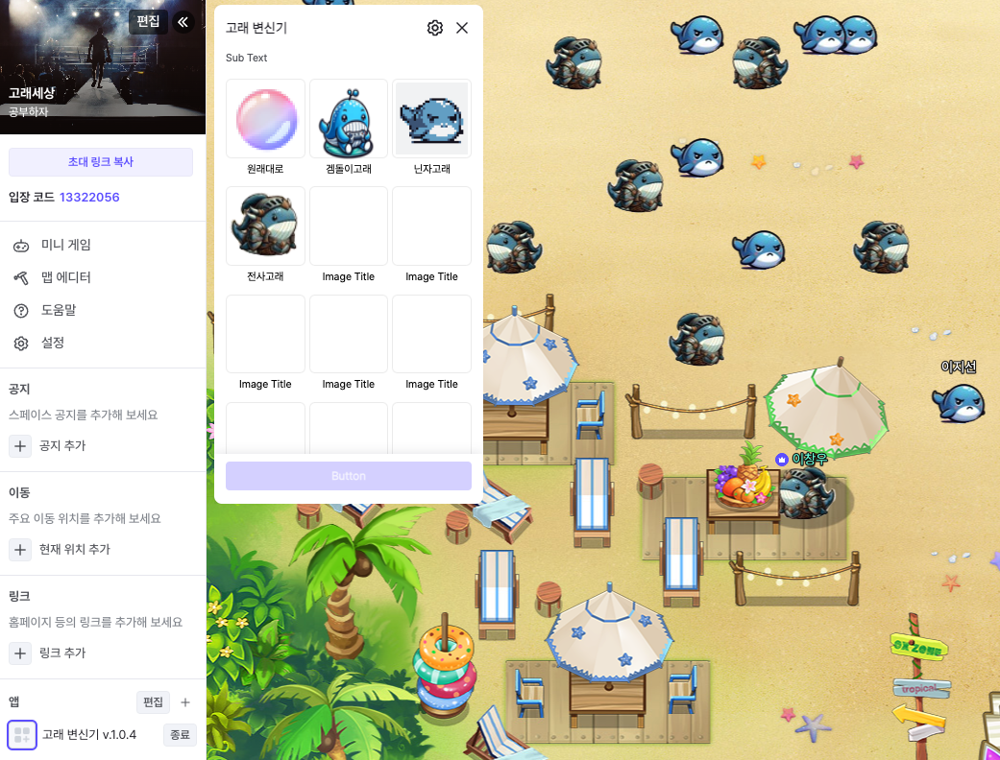

### 진로 결정

저는 이제 거의 3년이 다 되어 가는 동안 개발을 하나의 취미 생활로써 바라봐왔기 때문에 그저 재미와 내 상상을 현실에 꺼낼 수 있는 수단으로써 다양한 개발을 접해봤습니다.

그래서 항해 99에 지원하면서 분야에 대해 고민을 굉장히 많이 했습니다.

처음에는 실제로 느낀 프론트엔드 기술의 변화에 매력을 느꼈습니다. 하지만 항해 99에서 다양한 사람을 만나고, 멘토님을 만나면서 시야가 넓어진 것 같습니다.

지금은 제가 만든 서비스를 몇 명이 써도 무너지지 않는 견고한 서버를 설계하고 지탱할 수 있는 힘 있는 백엔드 개발자가 되고 싶습니다.

### 미니 프로젝트

[고래키우기 Github](https://github.com/woo3145/growup-whale)

항해 99에서 3일간 미니 프로젝트를 진행했습니다. 팀원의 '고래 키우기' 아이디어가 너무 재밌고 항해 완주 기간 동안 즐겁게 할 수 있을 거 같아 재미있게 개발했습니다.

첫 협업이고, 첫 팀장을 맡아 아쉬운 것도 많았지만 배울 게 많은 프로젝트였습니다.

다음 프로젝트 진행 시 보완할 점은 다음과 같습니다.

- DB 설계 단계에서 충분한 토의와 ERD를 작성하자
- Git GUI와 Github Flow에 대한 가이드를 작성하여 러닝 커브를 줄이자
- PR을 Merge 시킬 때 불필요한 파일이나 주석, 로그를 꼼꼼히 확인하자
- 메인과 개발 브랜치를 분리하고, 나도 작업할 때 브랜치를 반드시 따서 작업하자
- Github의 issue와 project를 적절히 활용하여 구성원 모두 현재 진행 사항과 해야 할 일을 명확하게 인지하도록 하자

### 블로그 테마 제작

[gatsby-starter-cheese Github](https://github.com/woo3145/gatsby-starter-cheese)

마음에 드는 Gatsby 테마가 없어 11월 말부터 블로그 테마를 만들고 있습니다.
현재 블로그의 테마인데 이번 주에 포스트 필터링과 추가 보완작업 및 가이드를 작성할 생각입니다.
gatsby starter로써 어떻게 남들이 쉽게 사용할 수 있도록 고민하고 있습니다.

### ZEP 사이드바 앱 제작

[zep_whale_transformation Github](https://github.com/woo3145/zep_whale_transformation)

고래 키우기 ZepApp 이식 프로젝트를 위하여 간단히 고래로 변신할 수 있는 앱을 제작했습니다.
zep api를 꼼꼼히 읽어보는 중입니다. 다행히도 필요한 위젯 기능과 외부 api 사용이 가능하여 고래 키우기 앱 구상을 할 수 있었습니다.

## 나의 장점과 어떤 모습으로 성장하고 싶은가

제 장점은 진심으로 개발을 즐길 수 있는 마인드라고 생각합니다. 또한 몇 시간이고 한 가지 일에 몰입할 수 있는 집중력입니다.

저는 더욱 지식을 쌓고 협동력과 커뮤니케이션 능력을 길러 믿을 수 있는 리드 개발자가 되고 싶습니다. 그래서 제 즐거움이 팀원들에게 전파되어 진심으로 개발을 즐기는 분위기를 만들 수 있는 영향력을 주는 사람이 되고 싶습니다.
